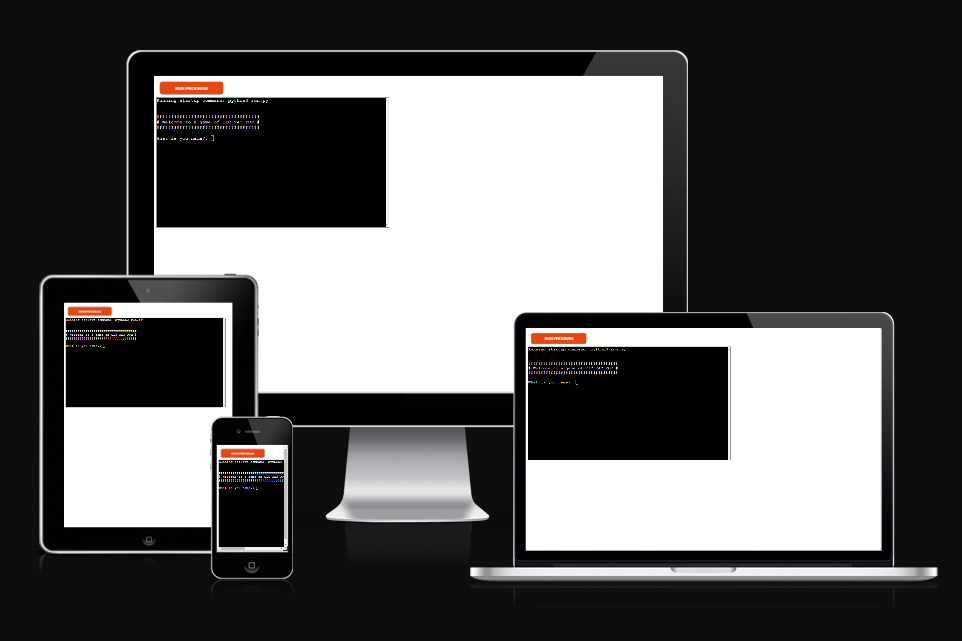
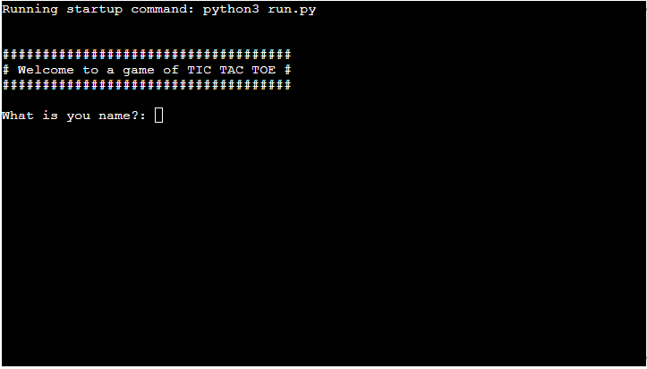
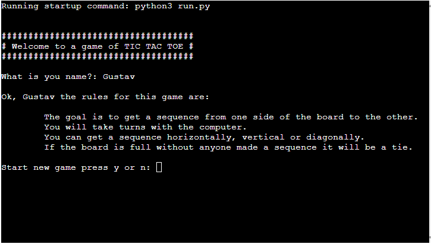
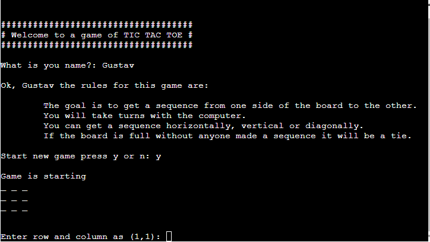
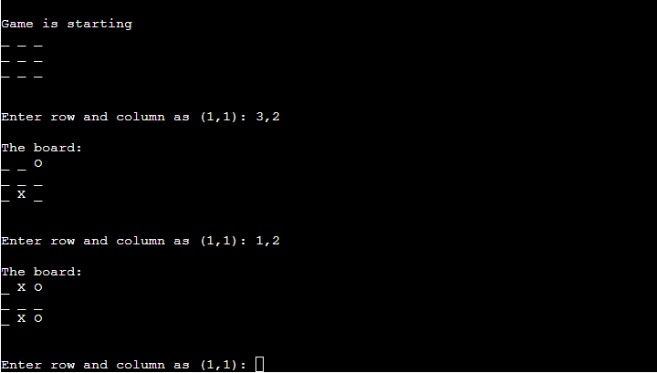
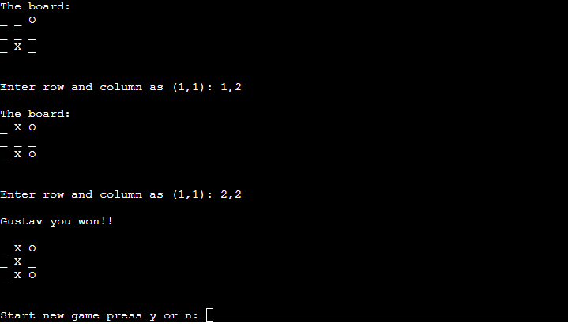
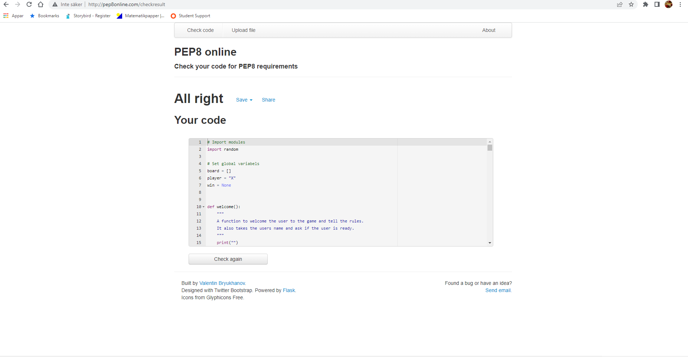

# TIC TAC TOE

Tic tac toe is a fun and easy game to play. It is original a pen and paper game. But i chosed it as my third project and made a python terminal game.
That runs in the Code institute mock terminal on Heroku. 

The user can try to get three in a row before the computer. You can get it horizontally, vertical or diagonally.
If the board is full before anyone got three in a row, it will be draw. 

You can try my game [here:](https://gurrastictactoe.herokuapp.com/)

## Table of contents

+ [UX](#ux "UX")
  + [User Stories](#userstories "User Stories")
   + [As a player:](#first-time-user "As a player")
+ [Features](#features "Features")  
  + [Welcome massage](#Welcome-massage "Welcome massage")
  + [Rules](#Rules "Rules") 
  + [Play Game](#Start-Game "Play Game")
+ [Future Features](#future-features "Future Features") 
+ [Python Libraries Used](#python-libraries-used "Python Libraries Used")  
+ [Testing](#testing "Testing")
+ [Bugs](#bugs "Bugs")
  + [Solved bugs](#Solved-bugs "Solved bugs")
+ [Remaining Bugs](#remaining-Bugs "(Remaining Bugs")
+ [Development and Deployment](#development-and-deployment "Development and Deployment")
+ [Credits](#Credits "Credits")

## UX:
### User Stories
#### As a player

- A easy to play game, with easy instructions
- See the board and every move
- I want to be able to play the game again or quit easily

## Existing Features:

### Welcome massage

When you start the app you get a welcome massage and the program asks for you name. You need to write your name with letters
or you will be ask to write it again. 

### Rules

Here you get the rules for the game and how it works. 
You also get a question if you want to start the game or not by pressing y or n

### Play game

The player makes the first move by input row and collum. The move gets validated to check so the move is inside the board frame, 
the spot is not taken or if the user have entered numbers.

After that the computer will make a random move and the system will check if someone got three in a row. 

If the user get three in a row first the terminal will write it out as "name" you won!!
If the computer get three in a row it will say that you lost. 
Or if the bord is full it will be a draw. 
And the user will get the question if he/she want to play again. 

## Futere Features

- Make it random who is the X or The O
- Make it so the user can choose the size of the board (I started to add this, but felt i did not have the time)
- Make it more colorfull (Tried abit, but dont have the knowledge yet)
- Make it a two players game

## Python Libraries Used

I only used the [Random](https://docs.python.org/3/library/random.html) for the computer random moves

## Testing

I manually tested the code in this project by doing the following:
- I gave invalid inputs: Strings when numbers were asked for, out of board moves and the same numbers twice.
- Printed out values to see what happens in the function and tried them out so i saw that they worked as the would. 
- I passed the code through [PEP8](http://pep8online.com/)

## Bugs

# Solved bugs
- The game said that i always put my move outside the board, fixed it to change the except statment to a if.
- I missed to check if the user inputed negativ numbers as a move, so i added a or to the if statment.
- When the system checked if there were three of the same sympol diagonally i had put and i instead of num.
- When the computer made his move it got stuck in a infinity loop, i forgot to put in the change player function. 

##Remaining Bugs

No bugs that i know of

## Development and Deployment

This project was developed through Gitpod, using the template provided by Code Institute.

The deployment is made using [Heroku](https://www.heroku.com/) following the listed steps:

1. Log in or register a new account on Heroku.
2. Click on 'New' in the dashboard and select 'Create New App'.
3. Select a uniquely name for the app and choose your region.
4. Click on "Create app".
4. When the app is created click on Setting. 
5. To improve compatibility with various Python libraries add Config Var with Key = PORT and the Value = 8000.
5. Add 2 buildpacks: Python and then Nodejs in this specific order.
6. Go back at the top and click on "Deploy" and select "GitHub".
7. Scroll down and click on 'Connect to GitHub'.
8. Search for your GitHub repository name by typing it.
9. Click on "Connect".
10. Scroll down and click on "Deploy Branch".
11. You will see a message "The app was successfully deployed" when the app is built with python and all the depencencies.
12. Click on view and you will see the [deployed site](https://gurrastictactoe.herokuapp.com/).

## Credits
To fellow students on Slack for inspiration and help. 
especially Aiman S
Code Institute for the deployment terminal. 

